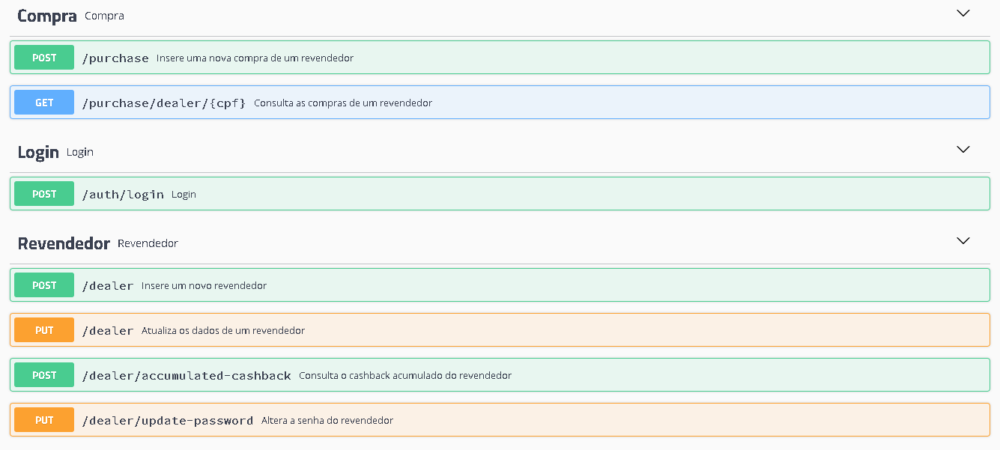

## Sobre

Esse projeto foi desenvolvido para a etapa de teste do processo seletivo do Grupo Boticário. Trata-se de uma API para os revendedores(as) cadastrarem suas compras e acompanhar o retorno de seu cashback.

O Swagger da API pode ser acessado através do link: http://167.99.1.51:5500/swagger-ui.html

## Ferramentas/Linguagens

Para o desenvolvimento dessa API, foi utilizado:

- **Kotlin**: Linguagem
- **Spring Boot**: Framework 
- **Spring Security**: Para adicionar autenticação e autorização à API
- **Spring Validation**: Para validar as informações do contrato
- **Swagger**: Para gerar documentação da API
- **MongoDB**: Banco de dados não relacional para armazenar os dados
- **JWT**: Autenticação via token
- **JUnit**: Framework para criação de testes

## Arquitetura

O projeto foi dividido nas seguintes camadas:

- **client**: Classes que se comunicam com serviços externos
- **config**: Classes de configuração
- **controller**: Classes que expõe as endpoints 
- **dto**: DTOs de entrada(request) e saída(response)
- **enums**: Classes de constantes
- **exception**: Classes de exceção
- **filter**: Classes de filtro e interceptor
- **handler**: Classe que trata os erros da API
- **helper**: Classes de ajuda
- **model**: Classes de entidades que serão persistidas na base
- **repository**: Classes que se comunicam com a base e manipulam as entidades
- **service**: Classes de serviços que implementam as regras de negócios

## Rotas

As rotas disponíveis para essa API são:

### Login

- **POST /auth/login**: Rota de login. É necessário informar o CPF e a Senha do revendedor para autenticar na API e obter o token.

### Revendedor

- **POST /dealer**: Rota para inserir um novo revendedor(a)
- **PUT /dealer**: Rota para atualizar os dados de um revendedor(a)
- **POST /dealer/accumulated-cashback**: Rota para consultar o acumulado de cashback do revendedor
- **PUT /dealer/update-password**: Rota para atualizar a senha do revendedor

### Compra

- **POST /purchase**: Rota para inserir uma nova compra de um revendedor
- **GET /purchase/dealer/{cpf}**: Rota para consultar todas as compras de um revendedor

Observações: As únicas rotas públicas são **POST /auth/login** e **POST /dealer**. As demais precisam de autenticação, ou seja, precisa passar no header o Authorization com o token.

